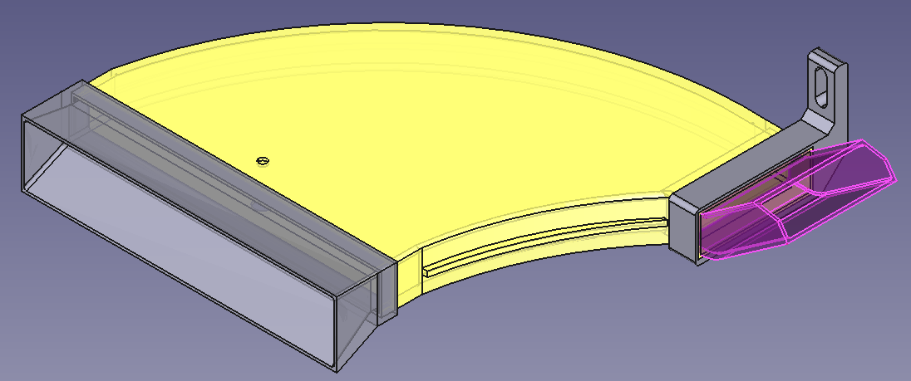

# Toyota GR Yaris rear diff cooling duct

3D printable rear diff duct for GR Yaris.
Loosely based on Airtec diff cooler.

## Technologies
- FreeCad

## Flavours
There are two flavours of this duct:
- ThinBoi with 1mm walls on main body and thicker walls elsewhere
- ThickBoi with 2mm walls on main body and **even thicker** walls elsewhere

## Printing
Part in split into separate bodies, but large printer is required for main bit. Idealy something around 45x45 (like Qidi X-MAX3).

Main body can be split in slicer into two halves to avoid filament waste on supports. There is a lip on the edge which allows to either plastic-weld it with soldering iron or to glue it together.

Other pieces are a press/snap fit, but glue is recommended to keep it all in one big piece.

### Parts:
- Inlet - cutout holes for main body are already bigger, to account for printer tolerances (as scaling this part in slicer would be hard)
- RearHanger - probably safest to scale it to 102-103 %
- Outlet - probably safest to scale it to 99%
- MainBody - print "as is"

**Bear in mind that due to printer's tolerance - You might need to scale some parts up/down.**

## Preview

### ThinBoi

#### Model

### ThickBoi

#### Model

## Additional hardware required to mount it to the car
- M6x20mm bolt (head length excluded)
- M6x80mm bolt (head length excluded)
- M6 self locking nut
- 3 wide M6 washers

## Topics
- GR Yaris
- Rear diff cooling
- Diff cooling
- GR Corolla
- Toyota