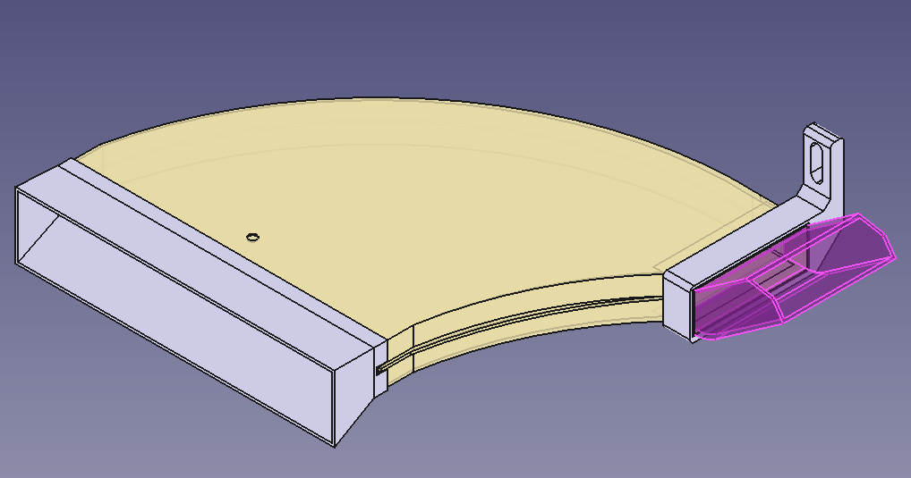

# gr-yaris-rear-diff-duct

3D printable rear diff duct for GR Yaris.
Loosely based on Airtec diff cooler.

## Technologies
- FreeCad

## Printing
Part in split into separate bodies, but large printer is required for main bit. Idealy something around 45x45 (like Qidi X-MAX3).

Main body can be split in slicer into two halves to avoid filament waste on supports. There is a lip on the edge which allows to either plastic-weld it with soldering iron or to glue it together.

Other pieces are a press/snap fit, but glue is recommended to keep it all in one big piece.

**Bear in mind that due to printer's tolerance - You might need to scale some parts up/down.**

## Preview

### Model

## Topics
- GR Yaris
- Rear diff cooling
- Diff cooling
- GR Corolla
- Toyota